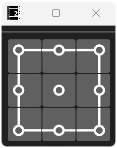

# 中心ずらし_A

オブジェクトの中心座標を移動する [AviUtl2](https://spring-fragrance.mints.ne.jp/aviutl/) 用のスクリプトです。「スクリプト適用 → 位置指定」をワンボタン行うための GUI（汎用プラグイン）が付属しています。

## 動作環境

- [AviUtl ExEdit2](https://spring-fragrance.mints.ne.jp/aviutl/)  
    `beta42` で動作確認済み。

## 導入方法

### AviUtl2 カタログを使う（推奨）

本スクリプトは [aviutl2-catalog](https://github.com/Neosku/aviutl2-catalog) に登録済みです。 メインメニュー ＞ パッケージ一覧 ＞ スクリプト ＞ 中心ずらし_A からインストールしてください

### 手動インストール

[Releases](https://github.com/azurite581/AviUtl2-AdjustPivot_A/releases/latest) から `AdjustPivot_A_v{version}.au2pkg.zip` をダウンロードし、AviUtl2 のプレビューにドラッグ&ドロップしてください。

> [!NOTE]
> ### For non-Japanese speaking users
> Please download the translation files from [here](https://github.com/azurite581/aviutl2_translations_azurite/releases/latest). 

## 使い方

### スクリプト単体で使う場合

デフォルトでは `配置` カテゴリにあります。

1. フィルタ効果を追加 → `配置` → `中心ずらし_A` を選択します。
2. リストボックスから中心座標の位置を指定します。

### プラグインを使う場合



#### 基本操作

1. 表示メニューから `中心ずらし_A` を選択してウィンドウを表示します。
2. オブジェクトを選択し、移動させたい位置のボタンをクリックします。

>[!Note]
> - オブジェクトに `中心ずらし_A` が適用されていない場合は自動的に追加されます。
> - すでに適用されている場合はパラメーターが書き換えられます。
> - 複数適用されている場合は一番下のエフェクトが書き換えの対象になります。

#### 設定

設定ウィンドウから各種設定を行います。  
※ウィンドウの上部をクリックするとメニューバーが展開されます。その中の歯車アイコンをクリックすると設定ウィンドウが開きます。

**変更時にオフセットをリセット**  
中心座標の位置を変更した際、オフセットを維持したままにするか 0 にリセットするかを指定します。初期値は `true` です。

**ボタンサイズ**  
ボタンのサイズをパーセンテージで指定します。初期値は `100` です。

設定を変更した場合は `中心ずらし_A_settings.json` に書き込まれます。

## パラメーター

### 位置

中心座標の位置を指定します。`左上`、`上`、`右上`、`左`、`中心`、`右`、`左下`、`下`、`右下` の 9 箇所から指定できます。初期値は `中心` です。

### オフセットX, Y

中心座標の位置を 0 としたときのオフセットを指定します。

### オブジェクトを移動

チェック有り：中心座標の位置は固定でオブジェクトを移動させます。  
チェック無し：オブジェクトの位置は固定で中心座標を移動させます。  
初期値はチェック無しです。

### PI

パラメーターインジェクション用の入力欄です。以下の形式に沿って値を入力することで、各種パラメーターの値を上書きできます（実際に入力するときは波括弧は不要です）。 範囲を超える値が入力された場合は自動で丸められます。

```lua
{ coord, offset_x, offset_y, obj_move }
```

| | 説明 | 型 | 範囲 |
| :--- | :--- | :--- | :--- |
| coord | 中心座標の位置 | number | [1, 9] |
| offset_x | X 方向のオフセット | number | |
| offset_y | Y 方向のオフセット | number | |
| obj_move | オブジェクトを移動させるかどうか | number または boolean | [0, 1] または false/true |

## ライセンス

[MIT License](LICENSE.txt) に基づくものとします。

## クレジット

### 使用したサードパーティライブラリ

[ThirdPartyLicenses](ThirdPartyLicenses.md) を参照してください。

### 使用したツール

#### [aulua](https://github.com/karoterra/aviutl2-aulua)

<details>
<summary>MIT License</summary>

```text
MIT License

Copyright (c) 2025 karoterra

Permission is hereby granted, free of charge, to any person obtaining a copy
of this software and associated documentation files (the "Software"), to deal
in the Software without restriction, including without limitation the rights
to use, copy, modify, merge, publish, distribute, sublicense, and/or sell
copies of the Software, and to permit persons to whom the Software is
furnished to do so, subject to the following conditions:

The above copyright notice and this permission notice shall be included in all
copies or substantial portions of the Software.

THE SOFTWARE IS PROVIDED "AS IS", WITHOUT WARRANTY OF ANY KIND, EXPRESS OR
IMPLIED, INCLUDING BUT NOT LIMITED TO THE WARRANTIES OF MERCHANTABILITY,
FITNESS FOR A PARTICULAR PURPOSE AND NONINFRINGEMENT. IN NO EVENT SHALL THE
AUTHORS OR COPYRIGHT HOLDERS BE LIABLE FOR ANY CLAIM, DAMAGES OR OTHER
LIABILITY, WHETHER IN AN ACTION OF CONTRACT, TORT OR OTHERWISE, ARISING FROM,
OUT OF OR IN CONNECTION WITH THE SOFTWARE OR THE USE OR OTHER DEALINGS IN THE
SOFTWARE.
```

</details>

#### [aviutl2-cli](https://github.com/sevenc-nanashi/aviutl2-cli)

<details>
<summary>MIT License</summary>

```text
MIT License

Copyright (c) 2026 Nanashi. <sevenc7c.com>

Permission is hereby granted, free of charge, to any person obtaining a copy
of this software and associated documentation files (the "Software"), to deal
in the Software without restriction, including without limitation the rights
to use, copy, modify, merge, publish, distribute, sublicense, and/or sell
copies of the Software, and to permit persons to whom the Software is
furnished to do so, subject to the following conditions:

The above copyright notice and this permission notice shall be included in all
copies or substantial portions of the Software.

THE SOFTWARE IS PROVIDED "AS IS", WITHOUT WARRANTY OF ANY KIND, EXPRESS OR
IMPLIED, INCLUDING BUT NOT LIMITED TO THE WARRANTIES OF MERCHANTABILITY,
FITNESS FOR A PARTICULAR PURPOSE AND NONINFRINGEMENT. IN NO EVENT SHALL THE
AUTHORS OR COPYRIGHT HOLDERS BE LIABLE FOR ANY CLAIM, DAMAGES OR OTHER
LIABILITY, WHETHER IN AN ACTION OF CONTRACT, TORT OR OTHERWISE, ARISING FROM,
OUT OF OR IN CONNECTION WITH THE SOFTWARE OR THE USE OR OTHER DEALINGS IN THE
SOFTWARE.
```

</details>

## 更新履歴

[CHANGELOG](CHANGELOG.md) をご確認ください。
